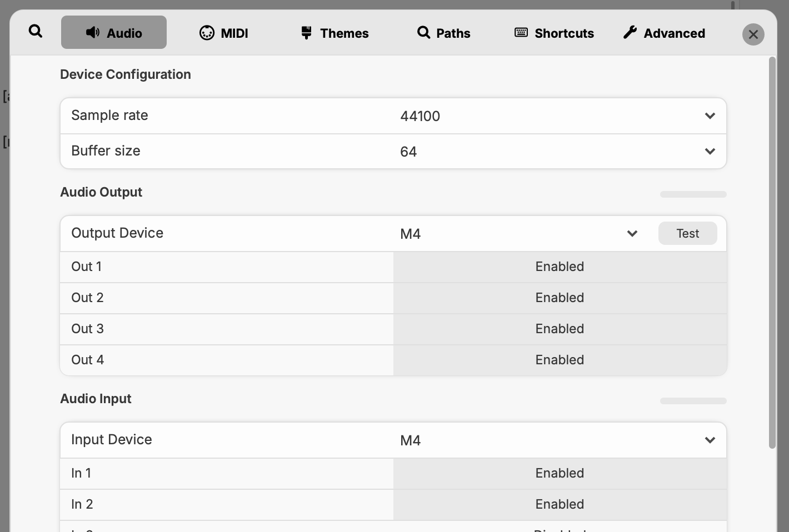
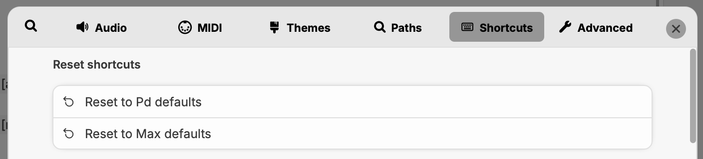
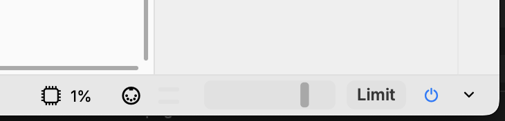
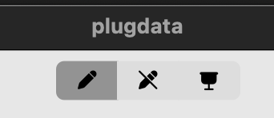
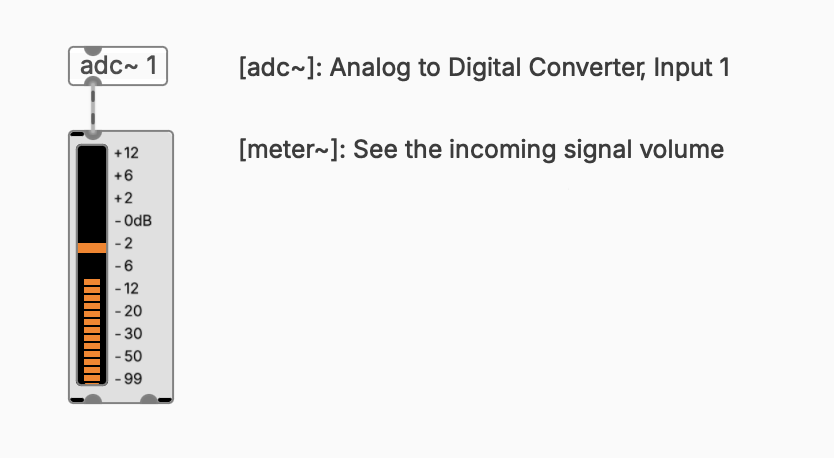
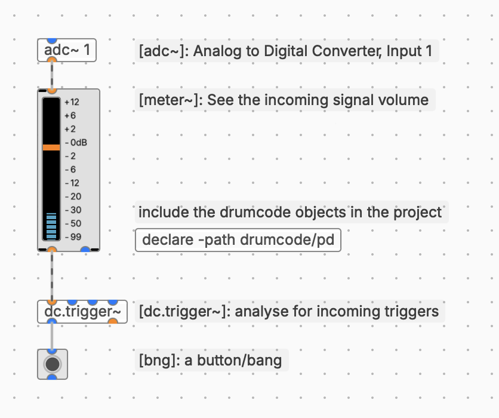
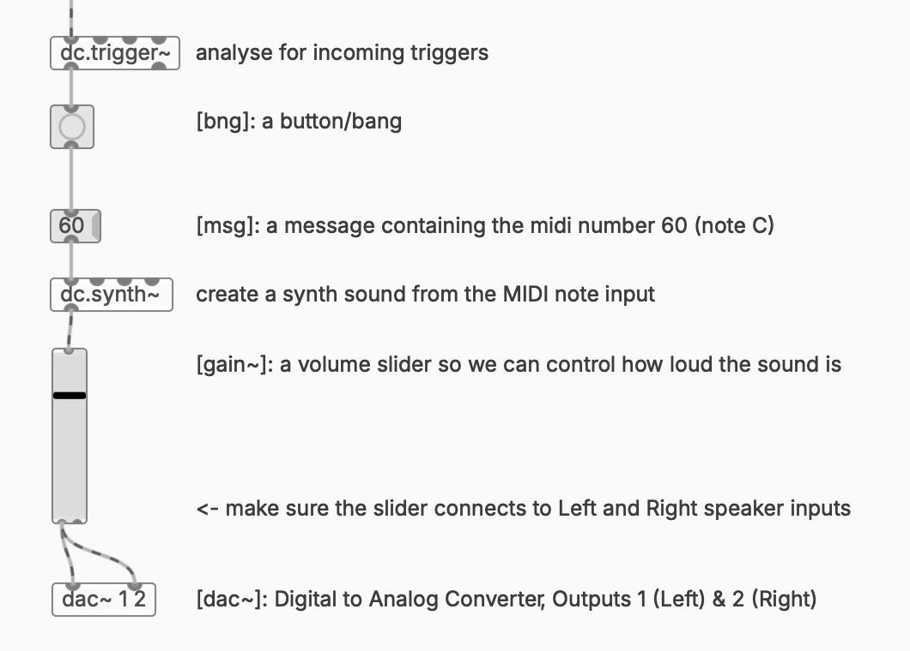

# Getting Started

Chapter 1: Attaching contact microphone to the drums
Chapter 2: Setting up the soundcard connections
Chapter 3: Setting up the computer software
Chapter 4: Receiving contact microphone input input
Chapter 5: Listening for triggers
Chapter 6: Triggering an electronic sound

## Attaching the contact microphone to the drums

### 1. Get a contact microphone (trigger)

We use a contact microphone to get the direct sound (vibrations) from a drumhead or cymbal. There are various forms of contact microphones that can be used. Some can be bought specifically for drums or other instruments like guitar, but it is also possible to make one by hand. Below a list of common contact microphones and a DIY guide:

- [ddrum trigger](https://www.thomannmusic.com/ddrum_acoustic_pro_pack.htm) (for kick, snare, toms)
- [roland trigger](https://www.thomannmusic.com/roland_rt_30hr_dual_trigger.htm) (for kick, snare, toms)
- [k&k hot spot](https://www.thomannmusic.com/kk_hot_spot.htm) (for kick, snare, toms and for other percussion & cymbals)
- [DIY trigger build guide (coming soon...)]() (for kick, snare, toms and for other percussion & cymbals)

Many of these triggers rely on a so called piezo element. This is a small metal plate with a ceramic top layer. When connecting this to a surface (like a drumhead) it can measure the variations in vibrations and convert those to a small alternating voltage.

### 2. Attach the contact microphone.

Depending on the trigger you have, follow the instructions of the manufacturer to attach it to the drumhead. If you build the trigger yourself, you can use some stage-tape (or gaffer-tape, gaffa-tape) to attach the contact microphone to the drumhead. **Don't use duct-tape**, since this will leave a lot of glue residue after removing.

## Setting up the soundcard connections

### 1. Get an external soundcard with instrument input

In order to receive the signal from the contact microphone in the computer we need an external USB soundcard with at least one 1/4" Jack input (sometimes called Hi-Z or Instrument input). Soundcards come in many shapes and price ranges. Depending on the amount of triggers you have you may need a bigger soundcard. Below is a list of some decent soundcards to get started with in the range of €50 - 150:

- [M-audio M-track Duo](https://www.thomann.de/nl/m_audio_m_track_duo.htm)
- [Presonus Studio 24c](https://www.thomann.de/nl/presonus_studio_24c.htm)
- [Behringer UMC404](https://www.thomann.de/nl/social_70th-anniversary.html)

### 2. Connect the trigger

Connect the trigger with the proper cable to the soundcard. For this you'll need to pay attention to the types of connections. There is XLR (microphone cable) or Jack (instrument cable), and both come in socket & plug variants. For example the ddrum trigger has an XLR output (plug), and the presonus studio interface has an XLR/Jack combo input. So you'll need an XLR socket to XLR plug cable, or XLR socket to Jack plug.

### 3. Gain the input

Play on the drum while adjust the input Gain on the soundcard by rotating the knob for the input. Make sure the input is as loud as possible, but **not clipping** (which means distortion). Most soundcards have an indication for this. The light is green/orange/yellow when it is in the safe zone, if it turns red the gain is too much and you'll have to dial back.

### 4. Connect the soundcard

Connect the soundcard to the computer via the USB port. You might need a USB dongle depending on the type of cable.

## Setting up the computer software

### 1. Install soundcard driver

You might need to install some driver based on the soundcard that you bought. Check the website of the manufacturer to make sure and download and install the software.

### 2. Install PlugData

This project uses the programming environment PlugData. Install it via [https://plugdata.org/download.html](https://plugdata.org/download.html)

### 3. Install drumcode

The drumcode project is a little extension for the PlugData environment. You need to download it and install it in the correct place. You can do this by: 

- [download `drumcode` here](https://github.com/tmhglnd/drumcode/archive/refs/heads/main.zip)
- Unzip the folder and move it to your `/Documents/plugdata/externals`
- Rename the folder to `drumcode`

### 3. Setting up PlugData

After downloading, start PlugData. You can open a New Patch via the menu icon or with `cmd/ctrl + n`. Go to the PlugData preferences via the menu (top-left) or with `cmd/ctrl + ,`. In the `Audio Settings` adjust the following settings:

- Samplerate: 44100
- Buffersize: 64
- Output Device: Choose your soundcard here
	- Outputs: Make sure they are `Enabled`
	- You can click `Test` to hear a short beep
- Input Device: Choose your soundcard here
	- Inputs: Make sure they are `Enabled`

</img>

Please also make sure you reset the shortcuts to Max default via the menu `Shortcuts` and `Reset to Max Defaults`. This will help later to have some useful shortkeys to work a bit faster.

</img>

### 4. Turn on the audio

Go back to the empty New Patch and click the "power" icon on the bottom right to make sure it is blue. This turns on the audio processing (called Digital Signal Processing or DSP).

</img>

## Receiving contact microphone input

Before we start patching, make sure the patch is in Edit Mode by clicking the pencil icon on the top of the window.

</img>

### 1. Create an input

To receive the sound from the contact microphone in the Patch, create an `[adc~ 1]` object. You can create objects by pressing `n` on the keyboard. `adc` stands for Analog to Digital Converter, which means we receive the analog signal from the contact microphone in the digital domain of the computer. The `1` stands for the first input, if we would use another input we type `2`, etc.

### 2. Seeing the signal

Connect the `[adc~ 1]` output to a new object that you create, called `[meter~]`. If this goes well you should see the signal come in while playing the drum.

</img>

## Listening for triggers

In order to perform events in the computer when we hit the drum we need to do some analysis on the signal. The drumcode project has some objects for this to make our live easier. In order to be able to use all the objects from drumcode you have to let PlugData know where they are, by declaring the path in the patch.

- Create an empty object and type `[declare -path /drumcode/pd]` in the patch

All the objects from drumcode start with the prefix `dc.`. And if an object does something with a signal (sound) it ends with the `~` (tilde). 

- Now create the object `[dc.trigger~]` and connect the output from the `[meter~]` to the input of the `[dc.trigger~]`.
- If we want to see the "trigger" happening we can visualise this in a button. Create a button by click `b` on the keyboard, or click `n` and type `bng`, a button is also called a "bang" (bng). Connect the output from `[dc.trigger~]` to the `button`. 
- Now hit the drum and see if the button lights up.

</img>

## Triggering an electronic sound

Now that we have a "trigger" (or also called a "bang" or "event") in the patch, we can use that to trigger some other process, like for example playing a MIDI note (for example a C) through a little synthesizer. For this we need a few things:

### 1. A MIDI-note

First we create a message (by clicking `m` on the keyboard), in this message we type the number `60` for the MIDI note. 

### 2. A Synthesizer that generates a sound

Now we create the `[dc.synth~]`, a simple synthesizer that we can use to produce some sound

We now connect the bang from the `[dc.trigger~]` output to the input of the message `60`, and we connect the output of the message to the input of the `[dc.synth~]`.

### 3. Output to the speakers

If we want to hear the sound from the synth we need to send it to the speakers. For that we use a `[dac~ 1 2]`. `dac` stands for Digital to Analog Converter, and 1 2 for the first and second output, which is the Left and Right speaker so we get a stereo sound.

**Never connect the synth directly to the speakers**. Always add a volume slider (or usually called a gain slider) in between, so you can adjust the volume to your liking

### 4. A volume slider

Create a `[gain~]` slider. You can now connect the output of the synth to the gain slider input. And connect the gain slider output to the Left and Right inputs from the `[dac~]`. 

Now you have to "Lock" the patch and put it in Run Mode by clicking the pencil icon with the stripe through on the top.

After locking the patch you can slowly increase volume of the slider and hear a note played when you hit the drum.

