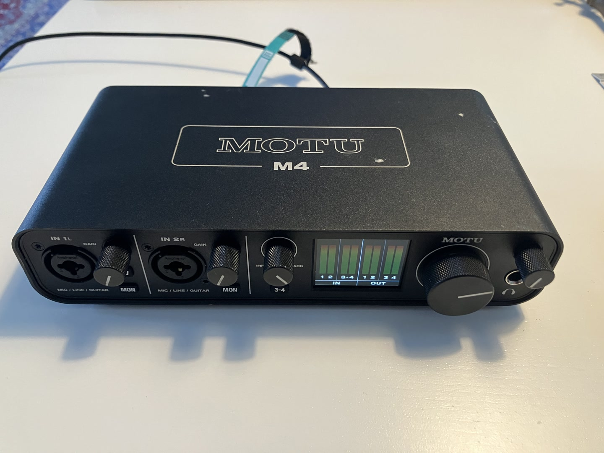

# Build your own drum triggers

The most basic way of creating a trigger is by using a contact microphone (also called a piezo disc, or piezo buzzer). The is a little metal disc with a ceramic top layer, that, when slightly bended continuously, outputs a small alternating voltage for the difference. This voltage can be captured by an external soundcard (or audio interface) and used as an audio signal to listen to. Many of the consumer grade triggers (like for instance the ddrum triggers) use this piezo disc as the technology behind their trigger.

You can buy these piezo discs for less than €1 per piece. And since we are mainly interested in using the signal as a trigger (not for recording studio quality sounds) it is also not too important what the soundquality of the piezo is, just as long as a clear signal can come through.

In order to build your own triggers you will need to buy some additional things such as a cable, a jack (socket or plug) and possibly some tools for soldering, stripping the cable and so on. Below is a list of materials needed with an example link, but depending on your location it can also be bought in a local store or different webstore.

A piezo disc is usually "unbalanced", meaning it has only a + signal and a ground. Therefore we only need a TS Jack Socket or Plug (T = Tip, S = Sleeve). A cable that has 2 wires is therefore sufficient. A microphone cable or guitar cable can both be used for this. A microphone cable has 2 wires and a shielding, in that case you can use both the center wires. A guitar cable has 1 wire and a shielding, in this case you will need to use the shielding. There are some piezo discs that have a 3rd part (like the one in my image below), this is called a feedback terminal. This is used if you want to create a speaker out of the piezo. But it is fine to use this piezo also for a trigger.

## Table of content

- [Gathering the materials](#gathering-the-materials)
- [Gathering the tools](#gathering-the-tools)
- [Stripping the cable](#stripping-the-cable)
- [Pre-soldering](#pre-soldering)
- [Soldering the cable](#soldering-the-cable)
- [Testing the piezo](#testing-the-piezo)
- [Coating the trigger](#coating-the-trigger)

## Gathering the materials

Make sure you've bought the following materials to make your trigger with. I recommend to buy a bit more of everything then needed, just in case something goes wrong during soldering. And if everything goes well you can make a few more of course!

- [Piezo disc](https://www.tinytronics.nl/en/audio/speakers/buzzers/piezo-electronic-buzzer-20mm) 
- [1/4" T(R)S Jack Socket](https://www.thomann.de/intl/thomann_sk096_klinkenkupplung.htm)
- [Balanced cable](https://www.thomann.de/intl/sommer_cable_sc_stage_22_highflex_sw.htm)
- [Plastidip](https://shop.plastidip.com/products/plasti-dip-can?variant=49236227129646) (optionally, for coating purposes)

## Gathering the tools

The tools you will need are:

- [Soldering iron with a small tip](https://www.tinytronics.nl/en/tools-and-mounting/soldering/soldering-irons-and-stations/budget-soldering-station-zd-99-48w?sort=p.price&order=DESC)
- [Soldering wire](https://www.tinytronics.nl/en/tools-and-mounting/soldering/consumables/solder-wire/premium-solder-wire-1.0mm-100g-lead-free?sort=p.price&order=DESC)
- [Wire cutting pliers](https://www.tinytronics.nl/en/tools-and-mounting/tools/pliers-and-cutters/cutters/toolland-diagonal-cutting-pliers?sort=p.price&order=ASC)
- [Wire stripper](https://www.tinytronics.nl/en/tools-and-mounting/tools/pliers-and-cutters/wire-strippers/premium-weicon-automatic-wire-stripper-no.-5?sort=p.price&order=ASC)
- [multimeter](https://www.tinytronics.nl/en/tools-and-mounting/measuring/multimeters/velleman-dvm010-digital-multimeter) optional, but very useful if anything is not working
- [Jack cable](https://www.thomann.de/intl/cordial_cti_3_ppsw.htm) for testing the trigger
- [Audio Interface](https://www.thomann.de/intl/focusrite_scarlett_solo_3rd_gen.htm) for testing the trigger

<!--  -->

## Stripping the cable

Cut a part of the cable to the desired length. I will use about 30cm.

Strip the outer jacket from the cable to reveal the inner shielding and wires. Do this on both sides (on side will be for the socket, the other side the piezo).

If you have an XLR cable, cut away the shielding and filler, otherwise only cut away the filler.

Now strip the insulation of the inner 2 wires to reveal the conductors.

## Pre-soldering

Turn on your soldering iron and wait till it became hot enough for soldering. In the meantime open the jack socket.

Make sure you check if your jack socket is a balanced (Tip, Ring, Sleeve) or unbalanced (Tip, Sleeve) socket. In both cases you want to only solder the *Tip* and the *Sleeve*. The tip is the **signal** (**+** or **hot**), the sleeve is **Ground** (**GND**), the ring is *unused*. My socket below is a TRS socket, and you can see one connection is slightly darker orange/brown colored, this is the ring. Sometimes the connection for the ring is slightly longer than the tip. The longest bottom part is in most cases the sleeve.

Now use a little bit of soldering wire to place some solder on the conductors of the cable and on the sleeve and tip of the socket.

## Soldering the cable

Before you solder the cable to the jack socket and the piezo, make sure you add the screw cap, spring and plastic shield to the cable *in the correct order*.

Now solder the wires of the cable to the socket. In general it makes sense to use the *blue* wire for *ground* and the *red* wire for the *+ signal*.

Then solder the wires of the other side of the cable to the piezo disc. For this you solder the *blue*/*ground* wire to the outer disc, and you solder the *red*/*+* wire to the ceramic part (inner disc). If you have a piezo with a feedback terminal then you can choose the terminal instead.

When the solder is cooled of and everything is connected properly you can screw the jack socket closed and the result should look something like this:

Now it's time to test the trigger!

## Testing the piezo

Use a jack-jack cable and an external audio interface to connect your trigger and test if the signal is coming in. Here I'm using a Motu M4, but any interface with a guitar jack input (sometimes refered to as Hi-Z) will be fine! If you have an interface with only XLR inputs, then use a jack-xlr cable to be able to connect.

Apply a little gain to the input and then tap the trigger with your finger to see if the signal comes through. If all went well this should be the case. If not, you will have to trace the issue. For this a [multimeter](https://www.tinytronics.nl/en/tools-and-mounting/measuring/multimeters/velleman-dvm010-digital-multimeter) can be very helpful! With the multimeter you can test the cable and soldered connections for *continuity* (is a current passing through the cable and connection properly).

## Coating the trigger

If you want the piezo to be a bit less fragile, you can coat it in plastidip. This is a liquid rubber coating that gives the connections on the piezo a bit more stability and durability. On top of that is also looks more finished!

Gently dip the trigger past the piezo up till about 1 or 2 cm of the cable in the plastidip. Then let it hang to dry. Put some cardboard below it to catch any dripping plastidip. You can repeat this process a few times after a couple hours of drying to add a few more layers. The final result will look something like this:

